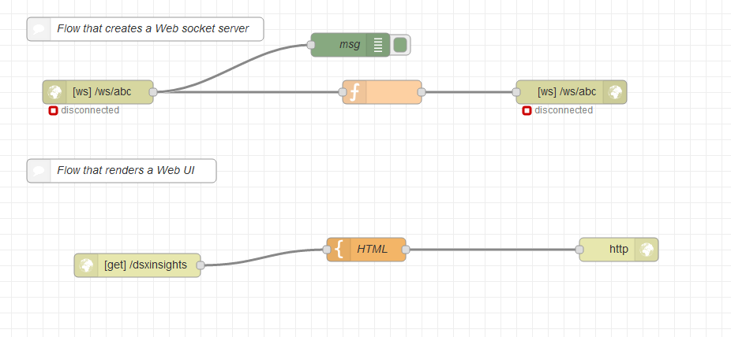

# knowledge graph insights
# work in progress
## Included components

* [IBM Watson Studio](https://www.ibm.com/cloud/watson-studio): Analyze data using RStudio, Jupyter, and Python in a configured, collaborative environment that includes IBM value-adds, such as managed Spark.

* [IBM Cloud Object Storage](https://console.bluemix.net/catalog/infrastructure/cloud-object-storage): An IBM Cloud service that provides an unstructured cloud data store to build and deliver cost effective apps and services with high reliability and fast speed to market. 

* [Watson Natural Language Understanding](https://console.bluemix.net/catalog/services/natural-language-understanding/?cm_sp=dw-bluemix-_-code-_-devcenter): An IBM Cloud service that can analyze text to extract meta-data from content such as concepts, entities, keywords, categories, sentiment, emotion, relations, semantic roles, using natural language understanding.

* [Node-RED](https://console.bluemix.net/catalog/starters/node-red-starter): Node-RED is a programming tool for wiring together APIs and online services.

## Featured technologies

* [Data Science](https://medium.com/ibm-data-science-experience/): Systems and scientific methods to analyze structured and unstructured data in order to extract knowledge and insights.

# Watch the Video

# Steps

Follow these steps to setup and run this developer journey. The steps are
described in detail below.

1. [Sign up for Watson Studio](#1-sign-up-for-watson-studio)
1. [Create IBM Cloud services](#2-create-ibm-cloud-services)
1. [Import the Node-RED flow](#3-import-the-node-red-flow)
1. [Note the websocket URL](#4-note-the-websocket-url)
1. [Update the websocket URL](#5-update-the-websocket-url-in-html-code)

## 1. Sign up for Watson Studio

Sign up for IBM's [Watson Studio](http://dataplatform.ibm.com/). By creating a project in Watson Studio a free tier ``Object Storage`` service will be created in your IBM Cloud account

## 2. Create IBM Cloud services

Create the IBM Cloud services required for the individual code patterns:

  * [Extend Watson text classification](https://github.com/IBM/watson-document-classifier/#2-create-ibm-cloud-services)
  * [Orchestrate data science workflows using Node-RED](https://github.com/IBM/node-red-dsx-workflow#2-create-ibm-cloud-services)

## 3. Import the Node-RED flow
* [Clone this repo](https://github.ibm.com/rravipal/pattern2).
* Navigate to the [orchestrate_dsx_workflow.json](https://github.ibm.com/rravipal/pattern2/node-red-flow/knowledge_graph_insights.json).
* Open the file with a text editor and copy the contents to Clipboard.
* On the Node-RED flow editor, click the Menu and select `Import` -> `Clipboard` and paste the contents.

 
  
  
 
 #### Deploy the Node-RED flow by clicking on the `Deploy` button

## 4. Note the websocket URL

The websocket URL is ws://`<NODERED_BASE_URL>`/ws/abc  where the `NODERED_BASE_URL` is the marked portion of the URL in the above image.
### Note:
An example websocket URL for a Node-RED app with name `myApp` is `ws://myApp.mybluemix.net/ws/abc`, where `myApp.mybluemix.net` is the `NODERED_BASE_URL`. 

The NODERED_BASE_URL may have additional region information i.e. `eu-gb` for the UK region. In this case `NODERED_BASE_URL` would be: `myApp.eu-gb.mybluemix.net`. 

## 5. Update the websocket URL in HTML code
Click on the node named `HTML`.

Click on the HTML area and search for `ws:` to locate the line where the websocket URL is specified. 
Update the websocket URL with the base URL that was noted in the [Section 4](#4-note-the-websocket-url): 	

	var websocketURL = "ws://" + NODERED_BASE_URL + NODERED_websocket_path;
	

Click on `Done` and re-deploy the flow.
